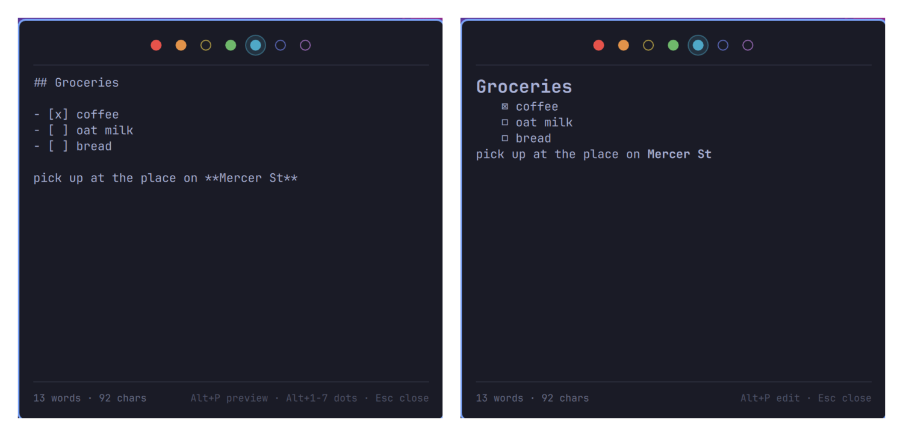

# Seven

> Seven notes. No titles, no files, no fuss.

Seven is a scratchpad that lives in your Omarchy bar. There are exactly seven
notes, each one a coloured dot. You do not name them, file them, or decide
where they go. You press a key and write.

Inspired by [Tot](https://tot.rocks) by The Iconfactory, which had the good
idea first. This is an independent implementation for Omarchy and is not
affiliated with or endorsed by The Iconfactory.



## What it does

- **Seven dots, always the same seven.** A dot is solid when it holds
  something and hollow when it doesn't, so the row is the only index you get.
  You stop filing and start writing.
- **One key away.** `SUPER + CTRL + J` opens it from anywhere and closes it
  again. The editor takes focus immediately, with the caret at the end of what
  you last wrote, on the dot you were last using.
- **Markdown when you want it.** Lists continue themselves, indentation is
  carried down, `Tab` is four spaces, and `Ctrl + B` / `Ctrl + I` /
  `Ctrl + 1`…`6` do what they do everywhere else. The `?` button lists the lot. `Alt + P` flips the current dot between its plain source and
  a rendered preview. Rendering is Qt's own Markdown support, so headings,
  lists, task lists, and links all work and there is no parser here to disagree
  with CommonMark.
- **Plain files, plainly named.** Each dot is a `.md` file in one directory.
  `grep` them, open them in `nvim`, sync them with Syncthing, put them in git.
  Edits made outside the panel show up in it live.
- **Saves itself.** Text is written a moment after you stop typing, and again
  when the panel closes. There is no save key because there is nothing to save.
- **Scriptable.** Append to a dot, read one back, or capture a line into the
  first empty dot from any shell.

## Install

```bash
omarchy plugin add https://github.com/melonamin/omarchy-seven.git --enable
```

Runtime requirements are Omarchy's `omarchy-shell` and Hyprland. Node is
required only for the tests.

Remove it with:

```bash
omarchy plugin remove melonamin.seven
```

Removing the plugin unregisters the shortcut and leaves your notes on disk.
Delete `~/.local/share/omarchy-seven` yourself if you want them gone.

## Use

Press `SUPER + CTRL + J`, or click the dot in the bar. It opens on the dot you
were last using, ready to type.

| Key | Does |
| --- | --- |
| `SUPER` + `CTRL` + `J` | Open or close the panel, from anywhere |
| `Alt` + `1`…`7` | Jump to that dot |
| `Alt` + `←` / `→` | Previous / next dot, wrapping |
| `Alt` + `P` | Flip between the editor and the rendered preview |
| `F1` or the `?` button | Show every shortcut on one sheet |
| `Esc` | Close the sheet if it is up, otherwise the panel |

You never have to remember any of this: the `?` in the bottom corner of the
panel opens a sheet with every key on it, including the ones below.


In the preview, `1`…`7` and the bare arrow keys move between dots. Letters do
nothing there — a key press while you are reading should never move you to a
different note.

On the bar dot itself: left click opens, **right click switches the dot between
its coloured and plain presentations**, middle click steps to the next note, and
the scroll wheel walks the row.

## Writing markdown

The editor knows just enough markdown to stay out of your way. Everything below
is an ordinary edit — `Ctrl + Z` undoes it.

| Key | Does |
| --- | --- |
| `Enter` | Continues the list you are in, numbering ordered items and leaving task boxes unchecked |
| `Enter` on an empty item | Ends the list and takes the marker away |
| `Shift` + `Enter` | A plain newline, with none of the above |
| `Tab` | Four spaces. Markdown counts nesting in spaces, and a literal tab renders at whatever width the next program feels like |
| `Ctrl` + `B` | Bold. Again on bold text removes it |
| `Ctrl` + `I` | Italic |
| `Ctrl` + `Shift` + `X` | Strikethrough |
| `Ctrl` + `1`…`6` | Make the line a heading of that level; the same key again clears it |
| `Ctrl` + `0` | Clear the heading |

Enter only continues a list when the caret is past the marker. With the caret
before it, Enter opens a line above, which is how you get a blank line in front
of a list you have already written.

The wrapping keys work on a selection, and leave it selected so you can stack
them. With nothing selected they drop in an empty pair and put the caret in the
middle.

## Settings

A bar widget's settings live inline on its entry under `bar.layout` in
`~/.config/omarchy/shell.json`, which is also where the bar's widget settings
UI writes them:

```json
{
  "bar": {
    "layout": {
      "right": [
        {
          "id": "melonamin.seven",
          "monospace": true,
          "showCounts": true,
          "colorfulDot": true,
          "shortcut": "SUPER + CTRL + J"
        }
      ]
    }
  }
}
```

- `monospace` — draw the editor in your configured monospace font. Off uses the
  bar's font.
- `showCounts` — show the word and character count under the editor. The count
  ignores tokens that are only markdown punctuation, so `# Groceries` and
  `- [x] coffee` each read as one word.
- `colorfulDot` — on, the bar dot takes the active note's colour and goes
  hollow when that note is empty. Off, it is a plain solid dot in the bar's own
  foreground, indistinguishable from every other item up there. Right-clicking
  the dot switches between the two and writes the choice here.
- `shortcut` — the global chord. Written in any of `SUPER + CTRL + J`,
  `SUPER+CTRL+J`, or `super, ctrl, j`. Set it to `""` to have no global
  shortcut at all. Omitting the key entirely keeps the default.

The first three appear as toggles in the widget settings UI. `shortcut` is a
string, so it is edited in `shell.json` by hand.

## The global shortcut

Seven registers `SUPER + CTRL + J` with Hyprland at runtime, through
`hyprctl eval`. It never writes to `hyprland.conf` or any other Hyprland
configuration file, and it re-registers itself after a config reload.

The binding carries a description, so it is listed in Omarchy's keybindings
menu (`SUPER + K`) as **Seven notes**. Selecting it there does nothing, though
— Hyprland reports runtime Lua binds without a dispatcher, so that menu can
show them but not fire them. Press the keys.

If another binding already owns your chord, Seven says so rather than failing
quietly:

```bash
omarchy-shell seven status | jq -r '.diagnostic'
# Shortcut collision: SUPER + CTRL + J
```

## Where the notes live

```text
~/.local/share/omarchy-seven/dots/1.md … 7.md
```

`$XDG_DATA_HOME` is honoured if you set it. Files are written atomically, so a
crash mid-save cannot leave you with half a note.

Seven watches those files, so editing them elsewhere works and shows up
immediately:

```bash
nvim ~/.local/share/omarchy-seven/dots/3.md
```

The change lands whether the panel is closed, open on another note, or open on
that very note with the cursor in it — in the editor and in the preview alike.
Editors that save by replacing the file (a temp file plus a rename, which is
`nvim`'s default) are noticed the same as an in-place write. If everything
before your cursor survived the change, the cursor stays where it was;
otherwise it moves to the end rather than landing mid-word.

There is exactly one case where an outside edit is refused: if it lands while
you are actually mid-sentence, your typing wins and gets written back. The
point is never to lose a sentence you were in the middle of.

There is no sync built in, on purpose. The files are ordinary enough that
Syncthing, `git`, or `rclone` will do a better job than this plugin could.

## Scripting

```bash
omarchy-shell seven open              # open the panel
omarchy-shell seven close
omarchy-shell seven toggle
omarchy-shell seven show 4            # open on a specific dot

omarchy-shell seven read 3            # print dot 3
omarchy-shell seven append 3 "milk"   # add a line to dot 3
omarchy-shell seven capture "idea"    # add to the first empty dot, print which
omarchy-shell seven clear 3           # empty dot 3

omarchy-shell seven status            # JSON: ready, dir, active dot, shortcut, dot style, lengths
```

`status` reports shape, not content: which dot is active, how many are filled,
how long each one is, and whether the shortcut registered. It never prints what
you wrote, so it is safe to paste into a bug report.

## Tests

Static checks and unit tests need no running shell:

```bash
tests/static.sh
node --test tests/model.test.js
```

The rest need Seven installed and enabled in a live Omarchy session. Both
snapshot all seven notes and restore them byte-for-byte on exit:

```bash
tests/integration.sh   # IPC round trips, writes to disk, external edits
tests/e2e.sh           # drives the real panel with wtype
```

`tests/e2e.sh` takes over the keyboard and, where `dotool` and Pillow are
installed, the pointer for a few seconds. Run it when you are
not mid-sentence somewhere else. It cannot press the global shortcut — synthetic
keys from a virtual keyboard do not trigger Hyprland's compositor-level binds —
so it checks that the bind is registered on the right chord, that nothing else
owns it, that it is listed in the `SUPER + K` menu, and that the command it
runs opens the panel.

## License

MIT
