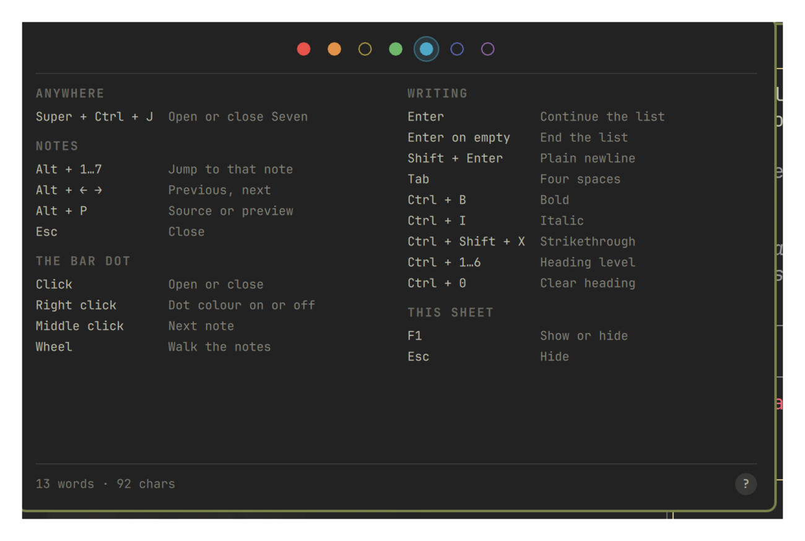

# Seven for Omarchy

A scratchpad that lives in your Omarchy bar. There are exactly seven notes,
each one a coloured dot. You do not name them, file them, or decide where they
go — you press a key and write. Each note is a plain `.md` file, so `grep`,
`nvim`, and Syncthing all work on it without this plugin's help.

Inspired by [Tot](https://tot.rocks) by The Iconfactory, which had the good
idea first. This is an independent implementation for Omarchy and is not
affiliated with or endorsed by The Iconfactory.

<video src="https://github.com/user-attachments/assets/02941be2-7858-476c-bc7c-a23fb5110435" controls muted width="880">
  <a href="https://github.com/user-attachments/assets/02941be2-7858-476c-bc7c-a23fb5110435">Watch the demo</a>
</video>

_Fifty seconds: the seven notes narrate their own tour, and the last one has you
run a command in a terminal and watch the text arrive._

## Features

- Seven notes, always the same seven — a dot is solid when it holds something
  and hollow when it doesn't, so the row is the only index you get
- `SUPER + CTRL + J` from anywhere, opening on the note you last used with the
  caret where you left it; the shortcut is listed in the `SUPER + K` menu
- Lists continue themselves, indentation carries down, and `Ctrl + B` / `I` /
  `1`…`6` do what they do everywhere else — the `?` button lists every key
- `Alt + P` flips a note between its markdown source and a rendered preview,
  drawn by Qt's own Markdown support rather than a parser bundled here
- Plain files in one directory, watched live: edit a note in `nvim` and it
  changes under the cursor, in the editor and the preview alike
- Saves itself a moment after you stop typing, and again when the panel closes;
  there is no save key because there is nothing to save
- Right-click the bar dot to switch it between the active note's colour and a
  plain dot that matches every other bar item

## Install

```bash
omarchy plugin add https://github.com/melonamin/omarchy-seven.git --enable
```

That is the whole install. The shell picks the plugin up without a restart and
puts the dot on your bar.

To remove:

```bash
omarchy plugin remove melonamin.seven
```

Removing the plugin unregisters the shortcut and leaves your notes on disk.
Delete `~/.local/share/omarchy-seven` yourself if you want them gone.

## Requirements

Omarchy 4 (Quattro) or newer, running `omarchy-shell` on Hyprland.

No external dependencies: everything used — `hyprctl`, `mkdir`,
`omarchy-shell` — ships with Omarchy. Nothing is downloaded at runtime and the
plugin makes no network connections, including for anything a note references.
(`node` is used by the test suite only.)

Seven writes to its own entry in `~/.config/omarchy/shell.json`, and only when
you change a setting. It never edits your Hyprland config: the global shortcut
is registered at runtime with `hyprctl eval` and is gone on the next reload
once the plugin is.

## Use

Press `SUPER + CTRL + J`, or click the dot in the bar.

| Key | Does |
|---|---|
| `SUPER` + `CTRL` + `J` | Open or close, from anywhere |
| `Alt` + `1`…`7` | Jump to that note |
| `Alt` + `←` / `→` | Previous, next — wrapping |
| `Alt` + `P` | Source or rendered preview |
| `F1` or the `?` button | Every shortcut on one sheet |
| `Esc` | Close the sheet if it is up, otherwise the panel |

In the preview, `1`…`7` and the bare arrow keys move between notes. Letters do
nothing there — a key press while you are reading should never move you to a
different note.

On the bar dot: left click opens, right click switches the dot's presentation,
middle click steps to the next note, and the wheel walks the row.

## Writing

The editor knows just enough markdown to stay out of your way. Everything here
is an ordinary edit, so `Ctrl + Z` undoes it.

| Key | Does |
|---|---|
| `Enter` | Continues the list, numbering ordered items and leaving task boxes unchecked |
| `Enter` on an empty item | Ends the list and takes the marker away |
| `Shift` + `Enter` | A plain newline, with none of the above |
| `Tab` | Four spaces |
| `Ctrl` + `B` / `I` | Bold, italic — again on wrapped text unwraps it |
| `Ctrl` + `Shift` + `X` | Strikethrough |
| `Ctrl` + `1`…`6` | Heading level; the same key again clears it |
| `Ctrl` + `0` | Clear the heading |

`Enter` only continues a list when the caret is past the marker. With the caret
before it, `Enter` opens a line above — which is how you get a blank line in
front of a list you have already written.

You never have to remember any of this. `F1`, or the `?` in the corner:



## Where the notes live

```text
~/.local/share/omarchy-seven/dots/1.md … 7.md
```

`$XDG_DATA_HOME` is honoured if you set it. Writes are atomic, so a crash
mid-save cannot leave you half a note.

Seven watches those files, so editing them elsewhere works:

```bash
nvim ~/.local/share/omarchy-seven/dots/3.md
```

The change lands whether the panel is closed, open on another note, or open on
that very note with the caret in it — in the editor and in the preview alike.
Editors that save by replacing the file (a temp file plus a rename, `nvim`'s
default) are noticed the same as an in-place write. If everything before your
caret survived the change the caret stays put; otherwise it moves to the end
rather than stranding itself mid-word.

There is one case where an outside edit is refused: if it lands while you are
mid-sentence, your typing wins and gets written back. The point is never to
lose a sentence you were in the middle of.

### Size

Seven reads at most **1 MiB** of a note. Past that it declines to load the file
at all: the dot shows why, the editor goes read-only, and `append`, `clear`,
and typing are all refused, so a file Seven never read is never written over.
Delete or shrink it and the dot recovers the next time the panel opens.

The reason is that `omarchy-shell` is one long-lived process that also draws
the bar, the lock screen, and the notifications. These files are externally
editable and may be synced from another machine, so their size is not Seven's
to assume, and a note large enough to exhaust that process would take the
desktop with it. Nothing unbounded is ever read — a 512 MiB note costs the same
fixed read as a 512 byte one.

No sync is built in, on purpose. The files are ordinary enough that Syncthing,
`git`, or `rclone` will do a better job than this plugin could.

## Settings

The bar's widget settings UI carries the three toggles; everything writes to
this plugin's entry under `bar.layout` in `~/.config/omarchy/shell.json`, which
you can also edit by hand — it hot-reloads on save.

| Key | Values | Default |
|---|---|---|
| `monospace` | `true`, `false` — the editor's font | `true` |
| `showCounts` | `true`, `false` — word and character count | `true` |
| `colorfulDot` | `true` for the active note's colour, `false` for a plain bar-coloured dot | `true` |
| `shortcut` | keybind for the panel; `""` registers nothing | `SUPER + CTRL + J` |

`shortcut` is a string, so it has no toggle in the settings UI. It is written in
any of `SUPER + CTRL + J`, `SUPER+CTRL+J`, or `super, ctrl, j`. Hyprland
silently refuses a chord another bind already owns, so
`omarchy-shell seven status` reports `shortcutRegistered` and a `diagnostic`
saying which chord collided.

The word count ignores tokens that are only markdown punctuation, so
`# Groceries` and `- [x] coffee` each read as one word.

## IPC

```bash
omarchy-shell seven open              # also close, toggle
omarchy-shell seven show 4            # open on a specific note

omarchy-shell seven read 3            # print note 3
omarchy-shell seven append 3 "milk"   # add a line
omarchy-shell seven capture "idea"    # add to the first empty note, print which
omarchy-shell seven clear 3

omarchy-shell seven status            # JSON: ready, dir, active note, shortcut, panel mode, lengths
```

`status` reports shape, not content: which note is active, how many are filled,
how long each one is, which face the panel is showing, whether the shortcut
registered, and any note that was too large to load. It never prints what
you wrote, so it is safe to paste into a bug report.

## Notes are untrusted

A note is not something only you can write. The files are ordinary files any
local process can put bytes into, `seven append` is reachable by anything that
can talk to the shell's socket, and a synced directory carries whatever another
machine wrote. Seven renders notes on that basis.

Qt makes this sharper than it looks. A `Text` with no `textFormat` sniffs its
own input and renders anything tag-shaped as rich text; rich text and markdown
both fetch what an image points at. So a note beginning
`` would have made the shell issue that request
merely by your hovering the bar — a note that beacons.

- The bar tooltip escapes note text and wraps it in a tag of its own, so the
  format is settled rather than guessed and there is no markup a note can add.
- Markdown images are defused before the preview sees them: ``
  renders as an ordinary link, so the words stay and nothing is fetched until
  you deliberately click. The preview also holds no text while it is hidden,
  because a `Text` parses and fetches whether or not it is drawn.
- A link may only hand `http`, `https`, or `mailto` to `xdg-open`. `file:` and
  app-registered schemes can open or run things, and a note picks both the
  label and the target, so you cannot see where one goes before clicking.
- No note is read in full. Reads are capped at the source rather than checked
  and then performed, so there is no size to trust and no window in which a
  file can be measured and then grow. See [Size](#size).

`tests/e2e.sh` plants each of these against a local HTTP server and asserts it
hears nothing.

## How it works

```
keystroke ──▶ Panel.qml            one per display, all views of one service
                 │ every keystroke, no save key
                 ▼
              Service.qml ──── 400 ms debounce ────▶  dots/N.md   atomic write
                 ▲                                        │
                 └──────────── FileView watcher ──────────┘
                                nvim, Syncthing, git

SUPER+CTRL+J ──▶ hypr/seven.lua, loaded through `hyprctl eval`
                   └─ described bind, so `SUPER + K` lists it
```

The dropdown is a layer-shell `KeyboardPanel`, not an `xdg-popup`. The bar
surface is `WlrKeyboardFocus.None`, so a popup hung off it can be clicked but
never typed into — which is no use for somewhere to write.

A bar widget is instantiated once per display, so none of the text lives in the
widget. All seven notes live in the single service instance, and the panels are
interchangeable views onto it. That is also what makes the notes survive the
panel closing, which is the entire point of a scratchpad.

## Notes

- The `SUPER + K` menu lists the shortcut but cannot fire it from there:
  Hyprland reports runtime Lua binds without a dispatcher, so the menu can show
  them and not run them. Press the keys.
- Markdown is rendered by Qt, which follows CommonMark plus task lists. A
  construct Qt does not know renders as the literal text you typed.
- Notes are plain files with no locking. Two machines syncing the same
  directory will resolve a simultaneous edit however your sync tool does.

## Tests

```bash
tests/static.sh                   # manifest, QML syntax, wiring invariants
node --test tests/model.test.js   # unit: editing, counts, settings, the sheet
tests/integration.sh              # live: IPC round trips, disk, external edits
tests/e2e.sh                      # live: drives the real panel with wtype
```

The last two need Seven installed and enabled in an Omarchy session. Both
snapshot all seven notes and restore them byte-for-byte on exit. `tests/e2e.sh`
takes over the keyboard, and the pointer where `dotool` and Pillow are
installed, for a couple of minutes.

## License

MIT
